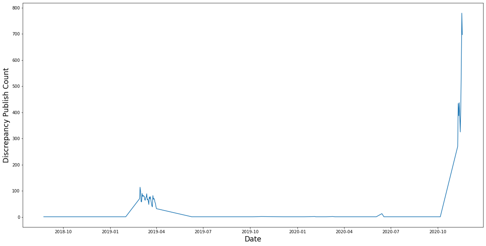
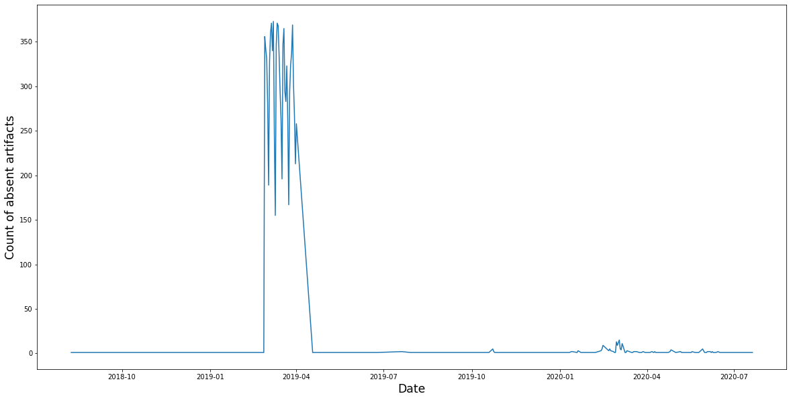
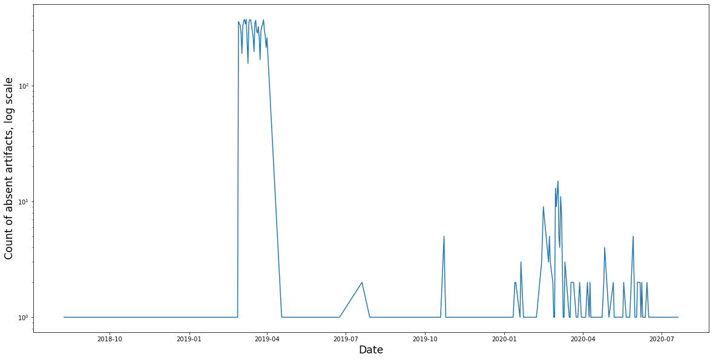

Let's prepare our data. We will select ZIP files from the bucket.


```python
!pv ./data/sites_published | grep .zip | \
	awk '{gsub(".zip$", "", $4);print $4}' > \
	./data/transformed/sites_published_zips.csv
```

     773MiB 0:00:22 [34.9MiB/s] [================================>] 100%            


Here is how look ids of the sites that we need to copy


```python
import pandas as pd
sites_to_copy = pd.read_csv(
	'./data/sites_to_copy.csv', names=['site_to_copy_ids'])
sites_to_copy.head()
```


<div>
<style scoped>
    .dataframe tbody tr th:only-of-type {
        vertical-align: middle;
    }

    .dataframe tbody tr th {
        vertical-align: top;
    }

    .dataframe thead th {
        text-align: right;
    }
</style>
<table border="1" class="dataframe">
  <thead>
    <tr style="text-align: right;">
      <th></th>
      <th>site_to_copy_ids</th>
    </tr>
  </thead>
  <tbody>
    <tr>
      <th>0</th>
      <td>0000201ae82e4b1293c860235894200f</td>
    </tr>
    <tr>
      <th>1</th>
      <td>00003b1c0f064827bdc7e0397139dc93</td>
    </tr>
    <tr>
      <th>2</th>
      <td>000047159c254c06848660d03a72f038</td>
    </tr>
    <tr>
      <th>3</th>
      <td>00008a6f271548ff9a6274620c7bd6cc</td>
    </tr>
    <tr>
      <th>4</th>
      <td>0000a6c1778a44d1a0687266a94f00a9</td>
    </tr>
  </tbody>
</table>
</div>


There are plenty of them:


```python
sites_to_copy.count()
```


    site_to_copy_ids    359165
    dtype: int64


Here is how look ids of the artifacts in the S3


```python
sites_published_zips = pd.read_csv(
	'./data/transformed/sites_published_zips.csv',
	names=['site_published_zips'])
sites_published_zips.head()
```


<div>
<style scoped>
    .dataframe tbody tr th:only-of-type {
        vertical-align: middle;
    }

    .dataframe tbody tr th {
        vertical-align: top;
    }

    .dataframe thead th {
        text-align: right;
    }
</style>
<table border="1" class="dataframe">
  <thead>
    <tr style="text-align: right;">
      <th></th>
      <th>site_published_zips</th>
    </tr>
  </thead>
  <tbody>
    <tr>
      <th>0</th>
      <td>00001f94c5c54973b5539aca547f48cf</td>
    </tr>
    <tr>
      <th>1</th>
      <td>0000201ae82e4b1293c860235894200f</td>
    </tr>
    <tr>
      <th>2</th>
      <td>0000237a29ef4155a731cac18e3425a5</td>
    </tr>
    <tr>
      <th>3</th>
      <td>0000252074964f219d47ea136ffef019</td>
    </tr>
    <tr>
      <th>4</th>
      <td>00002f6e7c274081873af579c80e3a25</td>
    </tr>
  </tbody>
</table>
</div>


Is there any site without an archive?


```python
diff = set(sites_to_copy['site_to_copy_ids'].values.tolist()).difference(
	set(sites_published_zips['site_published_zips'].values.tolist()))


print(bool(diff))
```

    True


Really? Give an example please.


```python
import random
random.sample(diff, 10)
```


    ['c1cfd45b9a08494f9cfe5123954e7a52',
     'e01d91d9d61b4d70a8a73c86aab47ff7',
     '4489c8217559412d970e2293ff869dd3',
     '672e4249f6b44d469c961becf98438b8',
     '223c1cb926594fe08aced914153a6c71',
     '44ba64233b204ed6a9221aa3413cebe1',
     '09c6459508ca49419692a032a8683722',
     'ed331420cdf1486f92d74768e1fd81bf',
     '615bfba479704c659a7f42a5b6856663',
     'f716eb3de23d4c1cafd17466679b8142']


How many?


```python
print('Total: %s' % len(diff))
```

    Total: 10673


Ok, let's prepare our data, but this time we will include object
 creation date.


```python
!pv ./data/sites_published | grep .zip | \
	awk '{gsub(".zip$", "" ,$4); print $4 "," $1 "T" $2 "Z"}' > \
	./data/transformed/sites_published_zips_with_dates.csv
```

     773MiB 0:00:26 [29.1MiB/s] [================================>] 100%            


Archives and their creation dates(a-la CSV).


```python
!head -n 5 ./data/transformed/sites_published_zips_with_dates.csv
```

    00001f94c5c54973b5539aca547f48cf,2016-03-09T19:07:12Z
    0000201ae82e4b1293c860235894200f,2020-10-05T06:02:05Z
    0000237a29ef4155a731cac18e3425a5,2017-11-07T05:16:45Z
    0000252074964f219d47ea136ffef019,2016-06-23T07:29:33Z
    00002f6e7c274081873af579c80e3a25,2015-11-05T21:27:35Z


Sites and their publishing dates(CSV).


```python
!head -n 5 ./data/sites_to_copy_with_dates.csv
```

    0000201ae82e4b1293c860235894200f,2020-10-05T06:02:04Z
    00003b1c0f064827bdc7e0397139dc93,2019-05-26T06:45:48Z
    000047159c254c06848660d03a72f038,2020-02-14T17:07:26Z
    00008a6f271548ff9a6274620c7bd6cc,2020-05-14T21:40:34Z
    0000a6c1778a44d1a0687266a94f00a9,2019-01-23T17:21:25Z


```python
sites_to_copy_with_dates = pd.read_csv(
	'./data/sites_to_copy_with_dates.csv',
	names=['site_to_copy_ids', 'site_published_date'],
	parse_dates=['site_published_date']
).set_index('site_to_copy_ids')
```


```python
sites_published_zips_with_dates = pd.read_csv(
	'./data/transformed/sites_published_zips_with_dates.csv',
	names=['site_published_zips_ids', 's3_object_published_date'],
	parse_dates=['s3_object_published_date']
).set_index('site_published_zips_ids')
```

We can join sites and archives on id


```python
dates_joined = sites_to_copy_with_dates.join(
	sites_published_zips_with_dates, lsuffix='l_', rsuffix='r_')
dates_joined.head()
```


<div>
<style scoped>
    .dataframe tbody tr th:only-of-type {
        vertical-align: middle;
    }

    .dataframe tbody tr th {
        vertical-align: top;
    }

    .dataframe thead th {
        text-align: right;
    }
</style>
<table border="1" class="dataframe">
  <thead>
    <tr style="text-align: right;">
      <th></th>
      <th>site_published_date</th>
      <th>s3_object_published_date</th>
    </tr>
    <tr>
      <th>site_to_copy_ids</th>
      <th></th>
      <th></th>
    </tr>
  </thead>
  <tbody>
    <tr>
      <th>0000201ae82e4b1293c860235894200f</th>
      <td>2020-10-05 06:02:04+00:00</td>
      <td>2020-10-05 06:02:05+00:00</td>
    </tr>
    <tr>
      <th>00003b1c0f064827bdc7e0397139dc93</th>
      <td>2019-05-26 06:45:48+00:00</td>
      <td>2019-05-26 06:45:49+00:00</td>
    </tr>
    <tr>
      <th>000047159c254c06848660d03a72f038</th>
      <td>2020-02-14 17:07:26+00:00</td>
      <td>2020-02-14 17:07:26+00:00</td>
    </tr>
    <tr>
      <th>00008a6f271548ff9a6274620c7bd6cc</th>
      <td>2020-05-14 21:40:34+00:00</td>
      <td>2020-05-14 21:40:35+00:00</td>
    </tr>
    <tr>
      <th>0000a6c1778a44d1a0687266a94f00a9</th>
      <td>2019-01-23 17:21:25+00:00</td>
      <td>2019-01-23 17:21:25+00:00</td>
    </tr>
  </tbody>
</table>
</div>


Let's calculate the timedelta between two publishing dates.


```python
dates_joined['timedelta'] = (dates_joined['s3_object_published_date']
	- dates_joined['site_published_date'])
```


```python
dates_joined.sort_values('timedelta')
```


<div>
<style scoped>
    .dataframe tbody tr th:only-of-type {
        vertical-align: middle;
    }

    .dataframe tbody tr th {
        vertical-align: top;
    }

    .dataframe thead th {
        text-align: right;
    }
</style>
<table border="1" class="dataframe">
  <thead>
    <tr style="text-align: right;">
      <th></th>
      <th>site_published_date</th>
      <th>s3_object_published_date</th>
      <th>timedelta</th>
    </tr>
    <tr>
      <th>site_to_copy_ids</th>
      <th></th>
      <th></th>
      <th></th>
    </tr>
  </thead>
  <tbody>
    <tr>
      <th>8a49866b2966498601298fd5da6f26c9</th>
      <td>2020-11-18 13:55:26+00:00</td>
      <td>2010-09-04 21:18:15+00:00</td>
      <td>-3728 days +07:22:49</td>
    </tr>
    <tr>
      <th>8a49866b2a910c98012a96734c144cbe</th>
      <td>2020-11-18 13:55:48+00:00</td>
      <td>2010-09-09 17:10:09+00:00</td>
      <td>-3723 days +03:14:21</td>
    </tr>
    <tr>
      <th>8a49866a2af939b8012afaf34d3a118c</th>
      <td>2020-11-18 13:43:41+00:00</td>
      <td>2010-09-10 10:01:53+00:00</td>
      <td>-3723 days +20:18:12</td>
    </tr>
    <tr>
      <th>8a49866a2afe125c012b094dfba27d42</th>
      <td>2020-11-11 12:41:20+00:00</td>
      <td>2010-09-13 05:19:18+00:00</td>
      <td>-3713 days +16:37:58</td>
    </tr>
    <tr>
      <th>8a4986cb2b8aa1a7012b9b38f7121aa7</th>
      <td>2020-11-18 13:56:03+00:00</td>
      <td>2010-10-11 12:17:31+00:00</td>
      <td>-3692 days +22:21:28</td>
    </tr>
    <tr>
      <th>...</th>
      <td>...</td>
      <td>...</td>
      <td>...</td>
    </tr>
    <tr>
      <th>ffefac401f764344be62136a24762b2b</th>
      <td>2019-03-21 17:56:01+00:00</td>
      <td>NaT</td>
      <td>NaT</td>
    </tr>
    <tr>
      <th>fff25cfce17b4ef1944e9a5ffa7c158f</th>
      <td>2019-03-25 20:49:20+00:00</td>
      <td>NaT</td>
      <td>NaT</td>
    </tr>
    <tr>
      <th>fff2f61e5b9e4306a7d078ad2f4982b6</th>
      <td>2020-11-09 11:15:17+00:00</td>
      <td>NaT</td>
      <td>NaT</td>
    </tr>
    <tr>
      <th>fffe31541ac74ec9b69a25a11d56e813</th>
      <td>2019-03-26 17:01:59+00:00</td>
      <td>NaT</td>
      <td>NaT</td>
    </tr>
    <tr>
      <th>fffe6d7976fc4d50a737b794682d41c7</th>
      <td>2019-03-13 10:45:45+00:00</td>
      <td>NaT</td>
      <td>NaT</td>
    </tr>
  </tbody>
</table>
<p>359167 rows × 3 columns</p>
</div>


```python
no_na = dates_joined.sort_values('timedelta').dropna()
short_discrepancy = no_na[(no_na['timedelta'] > pd.Timedelta(days=1))
	  | (no_na['timedelta'] < pd.Timedelta(days=-1))]
```

How many sites have publishing date discrepancy with their S3 object?
Also, exclude sites that miss archive completely.


```python
short_discrepancy.count()
```


    site_published_date         7065
    s3_object_published_date    7065
    timedelta                   7065
    dtype: int64


```python
import matplotlib.pyplot as plt
%matplotlib inline
```


```python
discrepancy_dates = short_discrepancy.apply(
	lambda row: row.site_published_date.date(), axis='columns')
```


```python
discrepancy_dates.value_counts()
pass
```


```python
plt.figure(figsize=(20, 10))
plt.xlabel('Date', **{'fontsize': 'xx-large'})
plt.ylabel('Discrepancy Publish Count', **{'fontsize': 'xx-large'})
discrepancy_dates.value_counts().plot()
```


    <AxesSubplot:xlabel='Date', ylabel='Discrepancy Publish Count'>


    

    


Now let's find more info about the absent artifacts.


```python
absent_values = dates_joined[
	dates_joined['s3_object_published_date'].isna()
	& (dates_joined['site_published_date'] < pd.Timestamp(
		'2020-11-01T00:00Z'))]
absent_dates = absent_values.apply(
	lambda row: row.site_published_date.date(), axis='columns'
)
absent_dates.value_counts()
pass
```


```python
plt.figure(figsize=(20, 10))
plt.xlabel('Date', **{'fontsize': 'xx-large'})
plt.ylabel('Count of absent artifacts', **{'fontsize': 'xx-large'})
absent_dates.value_counts().plot()
```


    <AxesSubplot:xlabel='Date', ylabel='Count of absent artifacts'>


    

    


The same plot, but Y-axis log scale, please?


```python
plt.figure(figsize=(20, 10))
plt.yscale('log')
plt.xlabel('Date', **{'fontsize': 'xx-large'})
plt.ylabel('Count of absent artifacts, log scale', **{'fontsize': 'xx-large'})
absent_dates.value_counts().plot()
```


    <AxesSubplot:xlabel='Date', ylabel='Count of absent artifacts, log scale'>


    

    


By the way, how many artifacts are absent before we started the work
 on this ticket?


```python
absent_values.count()

```


    site_published_date         10485
    s3_object_published_date        0
    timedelta                       0
    dtype: int64


```python

```
